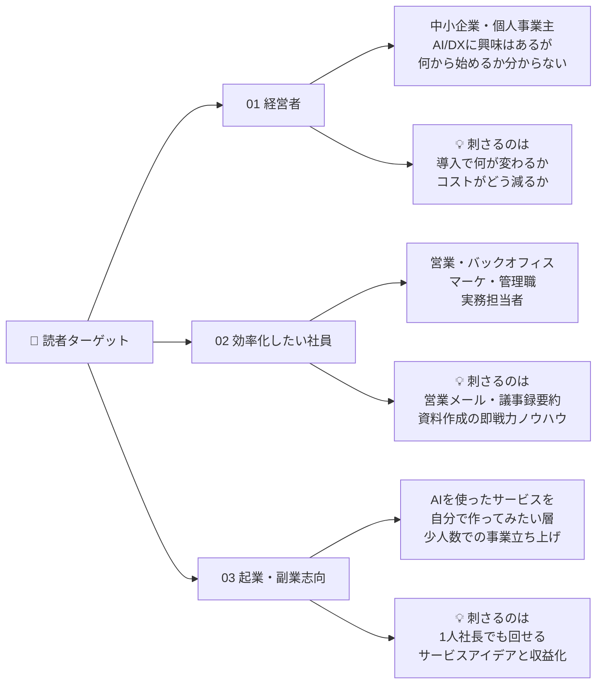
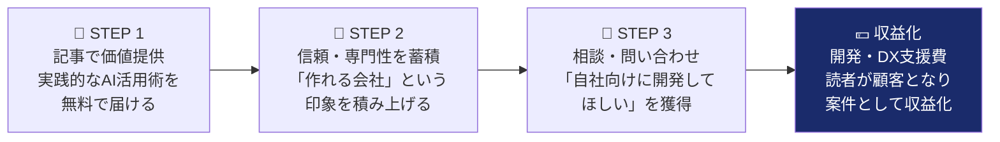
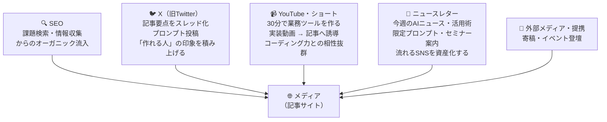
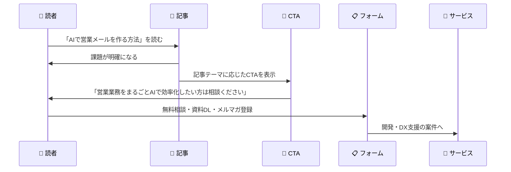
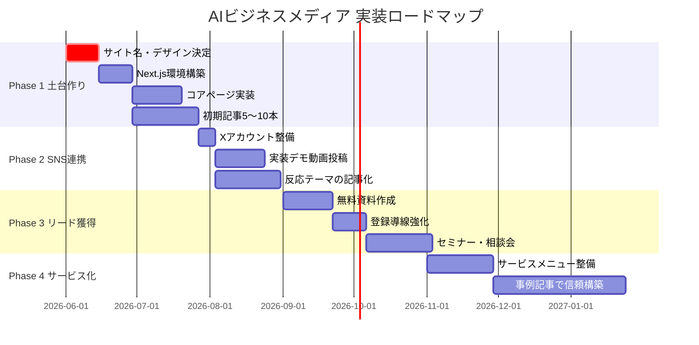
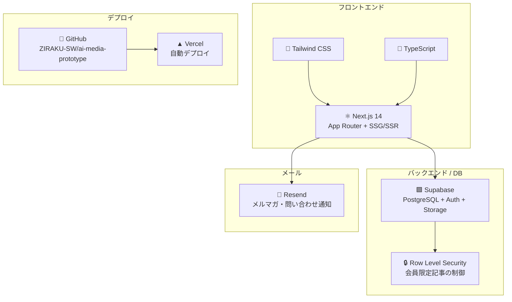
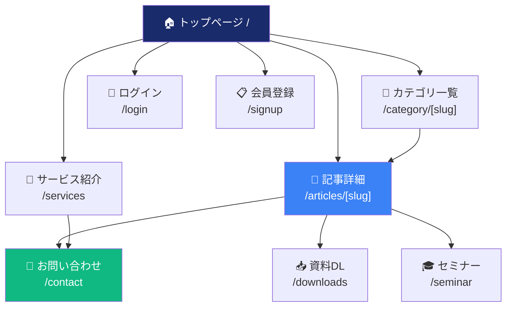

# 🚀 AIビジネスメディア — 全体ロードマップ & タスク管理

> **「AIで"使える"を届け、開発相談につなげるメディア」**  
> AI活用・DX・1人社長時代の実践メディア構想 / システム開発・AI/DX支援事業部

   

---

## 📋 目次

1. [なぜこのメディアか](#-なぜこのメディアか)
2. [コンセプト](#-コンセプト)
3. [ターゲット](#-ターゲット)
4. [収益モデル・ゴール](#-収益モデルゴール)
5. [コンテンツ構成](#-コンテンツ構成)
6. [差別化ポイント](#-差別化ポイント)
7. [拡散戦略](#-拡散戦略)
8. [リード獲得設計](#-リード獲得設計)
9. [4フェーズ ロードマップ](#-4フェーズ-ロードマップ)
10. [技術スタック](#-技術スタック)
11. [実装タスク全リスト](#-実装タスク全リスト)
12. [ページ設計](#-ページ設計)
13. [CTA設計](#-cta設計)
14. [現在の進捗](#-現在の進捗)
15. [次にやること（要意思決定）](#-次にやること要意思決定)

---

## 💡 なぜこのメディアか

```
一般的なAIメディア                    このメディア
─────────────────────                ─────────────────────
ニュース・ツール紹介が中心    →      実務での使い方まで踏み込む
読んでも「で、どう使う？」が残る →   読者がすぐ試せる・自社に活かせる
```

> **私たちはシステム開発会社として、AIを「実際に作って見せられる」立場にある。**  
> この強みを活かし、紹介で終わらない実践メディアを立ち上げる。

---

## 🎯 コンセプト

**AIを「難しい技術」ではなく「実務で使える道具」として届ける**

| テーマ | 内容 |
|--------|------|
| 🛠️ **THEME 01** 実務に直結するAI活用術 | 営業メール・提案資料・議事録をAIで作る / SNS投稿やバナーを生成AIで用意 / ChatGPT・Claude・Notion AI・Canvaの実務活用 |
| 🏢 **THEME 02** 「1人社長 ＋ AI」の事業構築 | 少人数でもAIでマーケ・企画・営業を回す / 商品企画・市場調査・LP作成をAIで / カスタマーサポートや業務自動化の実例 |

**キャッチコピー候補**

```
「毎日の業務に、AIという味方を。」        ← 親しみやすい路線
「AIでビジネスを加速する最前線のメディア」 ← プロフェッショナル路線
```

---

## 👥 ターゲット



---

## 💰 収益モデル・ゴール

### 読者のゴール vs 私たちのゴール

| | 読者にとって | 私たちにとって |
|--|-------------|---------------|
| **目的** | 仕事と事業を前に進める情報源 | 「AI/DXに強い会社」と知ってもらう |
| **経営者** | 業務効率化・DX推進・新規事業のヒント | 広告・アフィリエイト収益が**目的ではない** |
| **社員** | 日々の仕事をAIで効率化するきっかけ | 記事を入口に、信頼と専門性を伝える |
| **起業・副業** | AIで自分でも事業を始めるヒント | 最終的に**開発・DX支援の相談につなげる** |

### 収益化フロー



**数字・訴求データ（出典：各種調査レポート）**

| 指標 | 数値 |
|------|------|
| 小規模企業のAI導入率 | **82%** |
| 平均的な生産性向上 | **約45%** |
| AIスタック導入でのコスト削減 | **95〜98%** |

---

## 📂 コンテンツ構成

| # | カテゴリ | 内容 | 役割 |
|---|----------|------|------|
| 01 | 🤖 **AI活用ガイド** | ツール別・業務別の使い方。役立つ場面まで解説 | SEO流入の主力 |
| 02 | 🏢 **DX・業務改善** | 中小企業の業務効率化・自動化事例 | 経営者向け |
| 03 | 👤 **1人社長・副業・起業** | 少人数で事業を回す実例。「自社でも」を引き出す | 起業層向け |
| 04 | 📰 **AIニュース・トレンド** | 最新機能を実務目線で噛み砕いて紹介 | 話題性・拡散 |
| 05 | ⭐ **実験室・検証ブログ** | 実際にAIで作って試す。**差別化の核** | 信頼・技術力の証明 |
| 06 | 🛠️ **ツール比較** | プロンプト集・チェックリスト。検索流入に強い | SEO・リード獲得 |

---

## ⭐ 差別化ポイント

```
「紹介する」ではなく「作って見せる」
```

> **実際に作れる人が、実際に作って試している**  
> 単なる情報紹介ではなく、動くものを見せることで信頼感が生まれる。  
> 他のAIメディアにはできない差別化。

### 実験室コンテンツ例

| # | テーマ |
|---|--------|
| 01 | 営業メール作成ツールを作ってみた |
| 02 | ChatGPT APIで社内FAQボットを作る |
| 03 | スプレッドシート×AIで業務自動化 |
| 04 | 1人社長向けAI業務管理ツールを試作 |

### 強みの波及効果

```
実装力がある
    ↓
説得力がある → 技術力が伝わる → 相談したいと思われる
    ↓
SNSで拡散されやすい → 動画と相性が良い
    ↓
開発案件につながる
```

---

## 📢 拡散戦略



---

## 🎣 リード獲得設計

### 導線の流れ



### 無料リード獲得コンテンツ

| コンテンツ | 内容 | 目的 |
|-----------|------|------|
| 📋 AI活用チェックリスト | 自社のAI活用レベルを診断 | メアド取得 |
| 📝 営業効率化プロンプト集 | すぐ使える営業メールプロンプト | メアド取得 |
| 📊 DX診断シート | DX推進度を自己診断 | 経営者リード |
| 🎓 AI活用セミナー | 実践的な活用術を学ぶ | 高温度リード |
| 💬 無料相談会 | 自社の課題をヒアリング | 案件化 |

---

## 🗺️ 4フェーズ ロードマップ



### フェーズ詳細

| フェーズ | タイトル | 主なタスク | ゴール |
|---------|---------|-----------|--------|
| 🔴 **PHASE 1** | 土台作り | サイト名確定・デザイン決定・コアページ実装・初期記事5〜10本 | 公開できる状態にする |
| 🟠 **PHASE 2** | SNS連携 | Xアカウント整備・実装動画投稿・反応の良いテーマを記事化 | 流入を作る |
| 🟡 **PHASE 3** | リード獲得 | 無料資料・登録導線強化・セミナー・相談会実施 | メアドとリードを蓄積する |
| 🟢 **PHASE 4** | サービス化 | AI/DX相談・業務自動化・チャットボット開発メニュー整備 | 案件につなげる |

---

## 🛠️ 技術スタック



### Supabase テーブル構成

| テーブル | 用途 | RLS |
|---------|------|-----|
| `articles` | 記事本文・メタ情報 | ✅ 公開/会員限定制御 |
| `categories` | カテゴリ管理 | - |
| `tags` | タグ管理 | - |
| `article_tags` | 記事-タグ紐付け | - |
| `profiles` | ユーザープロフィール | ✅ 本人のみ更新 |
| `article_views` | 閲覧数カウント | - |
| `bookmarks` | ブックマーク | ✅ 本人のみ |
| `newsletter_subscribers` | メルマガ登録 | ✅ 誰でも登録可 |
| `inquiries` | 問い合わせ | ✅ 誰でも送信可 |

---

## ✅ 実装タスク全リスト

### 🔴 PHASE 1 — 土台作り

#### 意思決定（コードなし）
- [ ] デザインパターン確定（WIRED / Notion / Zapier から1つ選択）
- [ ] サイト名確定（例：AIBizNavi、AIZUKAN、Practable...）
- [ ] ドメイン取得
- [ ] サイトカラー・フォント確定

#### 環境構築
- [ ] `create next-app` でNext.jsプロジェクト作成
- [ ] Tailwind CSS + TypeScript設定
- [ ] Supabase クライアント設定（`@supabase/ssr`）
- [ ] 環境変数設定（`.env.local`）
- [ ] GitHub連携 → Vercel自動デプロイ設定
- [ ] 独自ドメイン設定（Vercel）

#### コアページ実装
- [ ] **トップページ** `/` — ヒーロー + 記事一覧 + メルマガCTA + 統計訴求
- [ ] **記事詳細** `/articles/[slug]` — 本文・関連記事・テーマ別CTA
- [ ] **カテゴリ一覧** `/category/[slug]` — 絞り込み・ページネーション
- [ ] **お問い合わせ** `/contact` — フォーム → Supabase保存 + メール通知
- [ ] **会員登録** `/signup` — Supabase Auth
- [ ] **ログイン** `/login` — Supabase Auth
- [ ] **サービス紹介** `/services` — AI/DX支援・開発メニュー
- [ ] **プライバシーポリシー** `/privacy`

#### 共通コンポーネント
- [ ] ヘッダー（ナビ・ログイン状態）
- [ ] フッター（リンク集・メルマガ）
- [ ] 記事カード
- [ ] カテゴリバッジ
- [ ] メルマガ登録フォーム（インライン・バナー）
- [ ] ティッカー（最新記事スクロール）
- [ ] CTA バナー（テーマ別出し分け）
- [ ] サイドバー（人気記事・カテゴリ）

#### 記事管理
- [ ] Supabase Storage 設定（画像アップロード）
- [ ] 管理画面 or 記事投稿の仕組みを決定
  - 選択肢A: Supabase Studio で直接投稿
  - 選択肢B: 簡易管理画面を作る `/admin`
  - 選択肢C: Notion → 記事同期
- [ ] **初期記事10本** 投入（下記テーマ候補）

#### 初期記事テーマ候補（10本）
| # | タイトル案 | カテゴリ |
|---|-----------|---------|
| 1 | ChatGPT-4oの新機能まとめ｜業務で使える7つの活用例 | AI活用ガイド |
| 2 | 中小企業のDXとは？成功するための3つのステップ | DX・業務改善 |
| 3 | Notion AIの使い方完全ガイド｜議事録作成を10倍効率化 | AI活用ガイド |
| 4 | 1人社長がAIで月商100万を達成した具体的な方法 | 1人社長・副業 |
| 5 | 在庫管理を自動化して在庫ロス80%削減した事例 | DX・業務改善 |
| 6 | おすすめAIツール30選【2026年最新版】 | ツール比較 |
| 7 | 営業メール作成ツールを30分で作ってみた【実験室】 | 実験室 |
| 8 | Claude 3.7の使い方｜ビジネス活用の完全ガイド | AI活用ガイド |
| 9 | ChatGPTプロンプト完全集｜業務別50選 | ツール比較 |
| 10 | スプレッドシート×AIで業務自動化した話【実験室】 | 実験室 |

---

### 🟠 PHASE 2 — SNS連携

- [ ] Xアカウント開設・プロフィール整備
- [ ] 記事公開ごとにスレッド投稿（要点3〜5個 + リンク）
- [ ] 実装デモ動画を作成・投稿（30分で〇〇を作るシリーズ）
- [ ] 反応の良いテーマを次の記事テーマに反映
- [ ] YouTubeチャンネル開設（任意）

---

### 🟡 PHASE 3 — リード獲得

- [ ] **無料資料①** AI活用チェックリスト（PDF）作成
- [ ] **無料資料②** 営業効率化プロンプト集（PDF）作成
- [ ] **無料資料③** DX診断シート（PDF）作成
- [ ] 資料DLページ `/downloads` — メアド入力 → ダウンロード
- [ ] メルマガ配信設定（Resend等）
- [ ] セミナーページ `/seminar`
- [ ] 記事末尾CTA の出し分け実装（カテゴリ別）
- [ ] Google Analytics 設定
- [ ] OGP / SNSカード設定

---

### 🟢 PHASE 4 — サービス化

- [ ] **サービスページ詳細化**
  - AI/DX導入支援メニュー
  - 業務自動化開発メニュー
  - チャットボット開発メニュー
- [ ] 事例記事（導入企業インタビュー）
- [ ] 料金・相談フロー明示
- [ ] 問い合わせ後の自動返信メール設定

---

## 📄 ページ設計



---

## 🔔 CTA設計

記事カテゴリに応じてCTAを出し分ける：

| カテゴリ | CTA文言 | リンク先 |
|---------|---------|---------|
| AI活用ガイド | 「最新AI活用ニュースをメールで受け取る（無料）」 | メルマガ登録 |
| DX・業務改善 | 「無料でAI/DX相談をする」 | お問い合わせ |
| 1人社長・副業 | 「業務自動化について相談する」 | お問い合わせ |
| AIニュース | 「最新ニュースをメールで受け取る」 | メルマガ登録 |
| 実験室 | 「自社向けに開発してほしい方はご相談ください」 | お問い合わせ |
| ツール比較 | 「DX診断チェックリストをダウンロード」 | 資料DL |
| 全記事共通 | 「セミナーに参加する」 | セミナーページ |

---

## 📊 現在の進捗（2026-06-01 時点）

| 項目 | 状態 | 詳細 |
|-----|------|------|
| デザインプロトタイプ（3パターン） | ✅ 完了 | WIRED / Notion / Zapier — Vercel公開済み |
| Supabase DBスキーマ | ✅ 完了 | 9テーブル・RLS・ポリシー設定済み |
| Supabase カテゴリデータ | ✅ 完了 | 6カテゴリ投入済み |
| GitHubリポジトリ | ✅ 完了 | ZIRAKU-SW/ai-media-prototype |
| Vercel公開 | ✅ 完了 | project-7bhii.vercel.app（リリース用） |
| oceanosfleet /Ziraku 公開 | ✅ 完了 | oceanosfleet.com/Ziraku（日常確認用） |
| Next.js本番コード（3テーマ） | ✅ 完了 | App Router + TypeScript + Supabase連携 |
| 初期記事（Supabase） | ✅ 完了 | **12本**投入済み（詳細は下記） |
| 記事詳細ページ（Markdownレンダリング） | ✅ 完了 | テーブル・コードブロック・リスト対応 |
| 記事カードUIリデザイン | ✅ 完了 | カテゴリアイコン・グラデーション・「記事を読む」ボタン |
| サムネイル画像 | ✅ 完了 | 全記事 picsum.photos に更新済み |
| 参考発信者調査PDF | ✅ 完了 | `docs/参考発信者メディア調査まとめ.pdf` |
| 企業AIコスト比較資料 | ✅ 完了 | `docs/ENTERPRISE_WEB_AGENT_COST.md` + 記事化 |
| デザイン確定 | ⬜ 未着手 | **要意思決定** — 3パターンから選択 |
| サイト名確定 | ⬜ 未着手 | **要意思決定** |
| 記事管理UI | ⬜ 未着手 | `/admin` は構造のみ。入力UIは未実装 |
| ニュースレター配信（Resend） | ⬜ 未着手 | Phase 3 |
| お問い合わせフォーム動作 | ⬜ 未着手 | DBは存在するが送信処理未実装 |
| 会員登録・ログイン動作 | ⬜ 未着手 | Supabase Auth の実装未着手 |
| SEO / OGP | ⬜ 未着手 | Phase 3 |

### 現在の記事一覧（Supabase 12本）

| # | slug | カテゴリ | 備考 |
|---|------|---------|------|
| 1 | generative-ai-business-guide-2026 | AI活用ガイド | |
| 2 | chatgpt-claude-gemini-comparison | ツール比較 | 本文あり |
| 3 | ai-meeting-minutes-automation | AI活用ガイド | |
| 4 | retail-dx-inventory-automation | DX・業務改善 | 本文あり（Before/After表） |
| 5 | solo-president-chatgpt-100man | 1人社長・副業 | |
| 6 | lab-sales-email-tool-30min | 実験室 | |
| 7 | ai-surprising-usecases-2026 | AIニュース | |
| 8 | best-ai-tools-2026 | ツール比較 | |
| 9 | free-ai-tools-sales-content | AI活用ガイド | 本文あり ★新着 |
| 10 | president-ai-first-tasks | 1人社長・副業 | 本文あり ★新着 |
| 11 | sme-ai-adoption-first-steps | DX・業務改善 | 本文あり ★新着 |
| 12 | enterprise-ai-cost-web-agent-vs-seat | 実験室 | 本文あり ★新着・コスト比較表 |

---

## 🚦 次にやること（要意思決定）

> これを決めないと実装が始められない

### 決定事項 1 — デザインパターン選択

| パターン | 雰囲気 | 向いているターゲット |
|---------|--------|-------------------|
| 🔵 **Pattern A: WIRED風** | インクブルー×セリフ体、重厚なエディトリアル | プロフェッショナル・経営者層 |
| 🟤 **Pattern B: Notion風** | 温かみのある余白重視、やわらかいUI | 一般社員・初心者層 |
| 🟠 **Pattern C: Zapier風** | オレンジアクセント×大胆タイポ、強いCTA | 起業・副業・アクション重視層 |

👉 **プロトタイプ確認:** https://oceanosfleet.com/Ziraku/

### 決定事項 2 — サイト名

```
候補例:
- AIBizNavi（AI + ビジネス + ナビゲート）
- Practable（Practical + Able）
- AIZUKAN（AI図鑑）
- AIのトリセツ
- その他
```

### 決定事項 3 — 記事管理方法

| 方法 | メリット | デメリット |
|-----|---------|-----------|
| Supabase Studio直接 | 追加開発不要・すぐ使える | UIが英語・使いにくい |
| 簡易管理画面 `/admin` | 使いやすいUI | 開発工数が増える |
| Notion連携 | 書き慣れたUIで記事作成 | 同期処理の実装が必要 |

---

## 🔗 リンク集

| 項目 | URL |
|-----|-----|
| GitHub | https://github.com/ZIRAKU-SW/ai-media-prototype |
| 本番（日常確認） | https://oceanosfleet.com/Ziraku/ |
| Vercel（リリース用） | https://project-7bhii.vercel.app |
| Supabase ダッシュボード | https://supabase.com/dashboard/project/wqlelowutbxplrzforcc |
| Pattern A (WIRED) | https://oceanosfleet.com/Ziraku/wired |
| Pattern B (Notion) | https://oceanosfleet.com/Ziraku/notion |
| Pattern C (Zapier) | https://oceanosfleet.com/Ziraku/zapier |
| 記事例（Notion） | https://oceanosfleet.com/Ziraku/notion/articles/chatgpt-claude-gemini-comparison |
| 記事例（Zapier） | https://oceanosfleet.com/Ziraku/zapier/articles/enterprise-ai-cost-web-agent-vs-seat |

---

<div align="center">

**「実践的な情報を届けながら、開発・DX支援の案件につなげる」**

前田さんの実装力で、見せられる差別化を。

  

</div>
