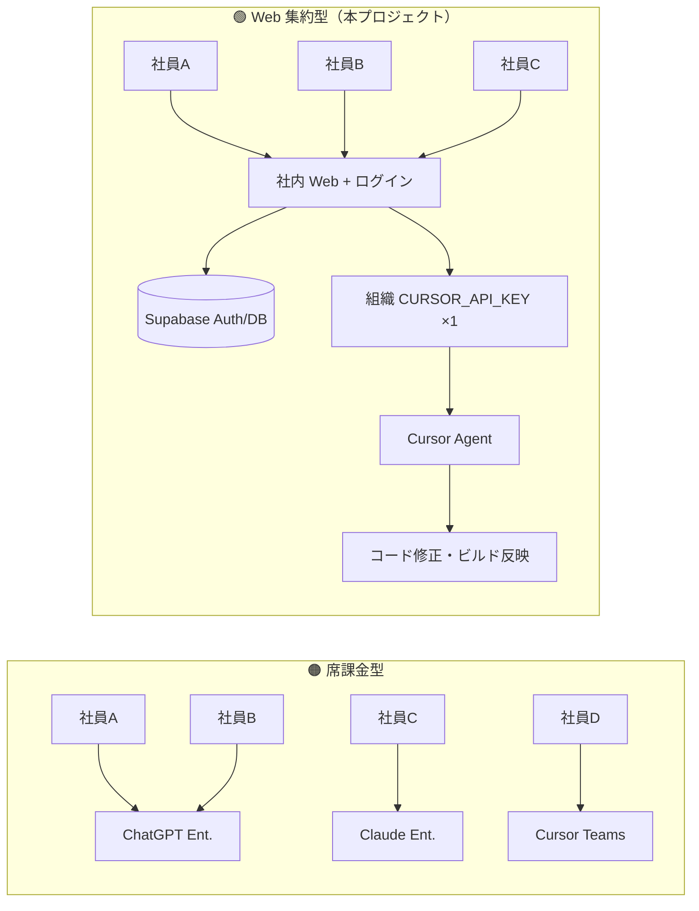

# 企業向け AI コスト設計 — 席課金 vs 社内 Web エージェント

> **要約（2026年5月試算）**  
> Supabase + ログイン付き社内 Web + **組織1本の Cursor API** なら、5〜100人規模で **席課金型（ChatGPT / Claude / Cursor Teams）より月額 65〜97% 安い**試算。  
> 削減の本体は「サーバー代ゼロ」より **「全員分の $25〜45/人/月 の席を買わない」** こと。  
> 📊 **カラー棒グラフ・構成図:** [https://oceanosfleet.com/pitch](https://oceanosfleet.com/pitch) を開き「企業 AI コスト」セクションへ（本 MD の直後に同内容のビジュアルあり）  
> 関連実装: [開発コンソール](https://oceanosfleet.com/AI/stock/dev) · 試算根拠: `doc/PORTFOLIO.md` §7 · §11 実測

---

## 1. 何を比較しているか

| 方式 | イメージ | 典型コスト |
|:---|:---|:---|
| 🟠 **席課金型** | 社員全員が ChatGPT / Claude / Cursor **に直接ログイン** | **$25〜45 × 人数 / 月** |
| 🟢 **Web 集約型** | 社内ポータルにログイン → サーバーが **API 1本** でエージェント実行 | **$66〜116 固定 + 従量 $0.3〜17.5/人** |



---

## 2. 固定費の内訳（Web 集約型）

| 項目 | 月額 USD | 色分け | メモ |
|:---|---:|:---|:---|
| Supabase Pro（〜50人） | **$25** | 🔵 インフラ | Auth・DB・MAU 込み |
| Supabase（100人目安） | **$75** | 🔵 インフラ | 帯域・MAU 余裕 |
| Cursor 組織 API（Teams 1席想定） | **$40** | 🟣 API | キー発行・管理用 |
| プラットフォーム自動化 SDK | **$1** | ⚪ 実測 | 870回/月 ≈ **$0.89**（PORTFOLIO §11） |
| **固定小計（50人以下）** | **$66** | | |
| **固定小計（100人）** | **$116** | | |

> Next.js 本体のホスティング（Vercel 等）は別途。本試算は **Supabase 中心**。

---

## 3. 従量費 — 開発コンソール（1人あたり）

モデル単価: **composer-2.5-fast**（入力 $0.50/1M · 出力 $2.50/1M）

| 利用強度 | 目安 | 1人/月 USD | バッジ |
|:---|:---|---:|:---|
| ライト | 月 **3回**・小修正 | **$0.30** | 🟢 |
| **標準** | 月 **8回**・機能追加 | **$2.40** | 🔵 推奨試算 |
| ヘビー | 月 **20回** | **$8.50** | 🟠 |
| パワー | 月 **40回**（エンジニア級） | **$17.50** | 🔴 |

---

## 4. 人数別 月額総コスト（標準利用）

**Web+Supabase+API** = 固定 + 標準従量（$2.40/人）

| 人数 | 🟢 Web 構成 | 実質/人 | 🟠 ChatGPT×N | Claude×N | Cursor×N | ChatGPT比 |
|---:|---:|---:|---:|---:|---:|---:|
| **5** | **$78** | $15.60 | $225 | $125 | $200 | **65% 安** |
| **20** | **$113** | $5.65 | $900 | $500 | $800 | **87% 安** |
| **50** | **$185** | $3.70 | $2,250 | $1,250 | $2,000 | **92% 安** |
| **100** | **$356** | $3.56 | $4,500 | $2,500 | $4,000 | **92% 安** |

```mermaid
xychart-beta
    title "月額総コスト比較（USD・標準利用）"
    x-axis [5人, 20人, 50人, 100人]
    y-axis "USD/月" 0 --> 5000
    bar [78, 113, 185, 356]
    bar [225, 900, 2250, 4500]
```

> 上段バー: Web+Supabase+API · 下段バー: ChatGPT Enterprise（$45/人想定）

---

## 5. 100人チーム — 利用強度別

| 想定 | Web 月額 | ChatGPT×100 | 削減率 |
|:---|---:|---:|---:|
| ライト | **$146** | $4,500 | **97%** |
| 標準 | **$356** | $4,500 | **92%** |
| ヘビー | **$966** | $4,500 | **79%** |
| パワー | **$1,866** | $4,500 | **59%** |

全員がエンジニア級でも **席課金より安い**ラインは広い。

---

## 6. 100人・標準の積み上げ内訳

| 積み上げ | USD/月 |
|:---|---:|
| 🔵 Supabase | $75 |
| 🟣 組織 API（1席） | $40 |
| ⚪ 自動化 SDK | $1 |
| 🟢 開発コンソール従量（100×$2.40） | $240 |
| **合計** | **$356**（実質 **$3.56/人**） |

---

## 7. 現実的な混合パターン（100人）

| 構成 | 月額 |
|:---|---:|
| エンジニア **10人**: Cursor IDE $40 + パワー Web $17.50 | （小計 $575） |
| 一般 **90人**: Web ライトのみ $0.30 | （小計 $27） |
| 固定（Supabase + API + 自動化） | $116 |
| **合計** | **約 $652/月** |
| 比較: 全員 Cursor Teams×100 | $4,000/月 → **約 84% 削減** |

---

## 8. 席課金型との違い（製品の性質）

| | ChatGPT Enterprise | Claude Enterprise | Cursor Teams |
|:---|:---|:---|:---|
| 課金の中心 | **人×月額**（チャット UI） | **席料 + API 従量** | **人×月額 + 従量** |
| 参考単価 | $30〜60/人/月 | $20/人 + API | $40/人（$20 枠込） |
| 自律コード編集 | ❌ UI のみ | △ 限定的 | ✅ SDK |
| 社内 Web に組み込み | 別途 API 契約 | API 従量 | ✅ 本プロジェクト |

> ChatGPT Enterprise は「全員が chat.openai.com を使う権利」に近く、**今回の開発コンソールのような自律エージェント組み込みとは別物**。

---

## 9. 規約・ガバナンス（必ず確認）

| 区分 | 内容 |
|:---|:---|
| ✅ 筋が通る | **Teams / Enterprise** の組織 API キー · サーバー側のみ保持 · 社内 IdP/ログイン · 利用ログ・上限 |
| ⚠️ 要確認 | Cursor の **Active User / True-up** が Web 利用者に及ぶか → **営業に一文で確認** |
| ❌ 非推奨 | **個人 Pro 1契約** を全社代理実行に使う（共有アカウント扱いのリスク） |
| ❌ 別契約 | 社外顧客への再販・マルチテナント SaaS |

---

## 10. 結論

1. **コスト**: 数人〜100人・非エンジニア中心なら Web 集約は **桁違いに安い**（試算上 65〜97% 削減）。  
2. **技術**: ログインで **個人ごとのエージェント画面** は実現済み（`/AI/stock/dev`）。  
3. **契約**: 安さの前提は **組織契約 + API 従量** であり、個人1アカウント共有ではない。  
4. **可視化**: `/pitch` ページに **棒グラフ・構成図** を掲載（本 MD と同期）。

---

*最終更新: 2026-05-31 · 試算モデル v1*
